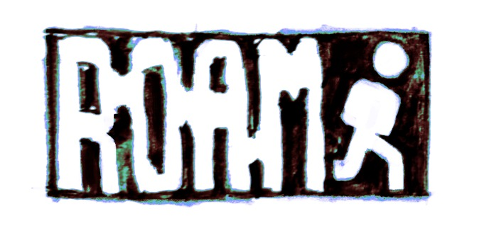

<p align="center">
    
</p>

Roamr is a platform built for urban exploration (urbex) enthusiasts, offering a trusted, community-driven map of verified locations worldwide. Users can discover, share, and document hidden places while accessing detailed site information, ratings, and safety insights.

Get a quick look at the project by visiting the [Roamr website](https://roamr.vercel.app/).

## 💻 Project Overview

This repository contains the frontend code for Roamr, built using Next.js. The goal is to create a fast, scalable, and user-friendly experience for exploring urbex locations. The backend and other infrastructure are managed separately.

The project is currently in the early stages of development, and I'm working on it in my free time. If you have any ideas or suggestions, feel free to open an issue or submit a pull request.

## 🌟 Features

### Core Functionality (Available / In Progress)

- 🔑 User Authentication & Authorization – Secure accounts & personalized access. (In Progress)
- 🗺️ Interactive Map – Pan, zoom, and search for worldwide places. (In Progress)
- 📍 Add & Edit Locations – Create and update location markers with details. (In Progress)
- 🔍 Advanced Search – Find locations by name, category, or tags. (In Progress)

### Upcoming Features (Next Up)

- ⭐ Community Ratings & Reviews – Share experiences and insights. (Planned)
- 👤 User Profiles & Achievements – Track contributions and progress. (Planned)
- 🖼️ Photo Galleries – Upload and browse images of locations. (Planned)

### Future Enhancements (Beyond MVP)

- ⚠️ Safety Insights & Warnings – Get hazard details for each location. (Planned)
- ✅ Location Verification & Moderation – Ensure accuracy & reliability. (Planned)
- 📱 Mobile-Friendly Experience – Optimized design for seamless mobile use. (Planned)

## 🛠️ Tech Stack

This project is built using the following technologies:

- [Next.js](https://nextjs.org/): React framework for building web applications.
- [Shadcn UI](https://ui.shadcn.com/): A collection of React components.
- [Tailwind CSS](https://tailwindcss.com/): Utility-first CSS framework.
- [MapLibre](https://maplibre.org/): Map rendering library.
- [Photon](https://photon.komoot.io/): Geocoding and Reverse Geocoding API.

## 🚀 Getting Started

To run this project locally, clone the repository, install the dependencies with your package manager of choice (I recommend [pnpm](https://pnpm.io/)), and then run the development server.

```bash
git clone https://github.com/cin4ed/roamr
cd roamr
pnpm install
pnpm run dev
```

Open [http://localhost:3000](http://localhost:3000) in your browser to see the app running.

## 🤝 Contributing

Contributions are always welcome and appreciated! At this moment I don't have a specific guideline for contributing, but feel free to submit a pull request with your changes and I'll review it as soon as possible.

## 📝 License

This project is licensed under the GNU General Public License v3.0. See the [LICENSE](LICENSE) file for more details.
